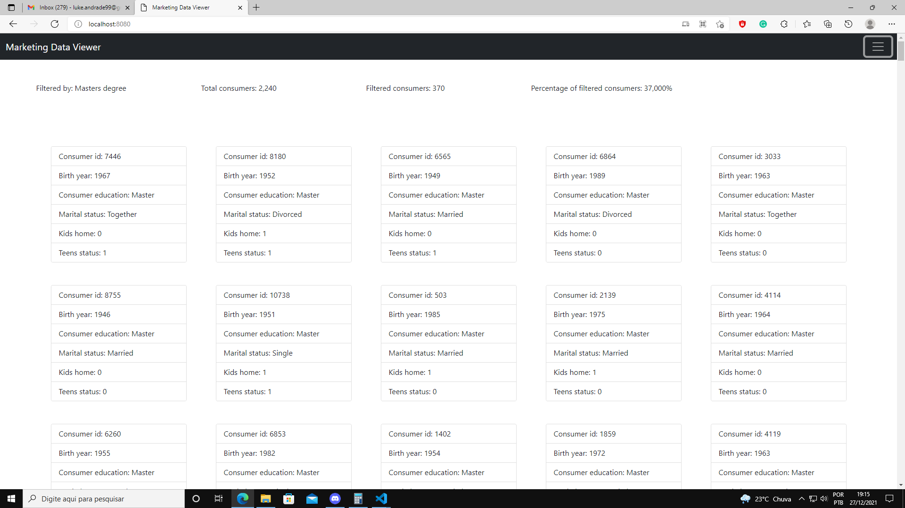
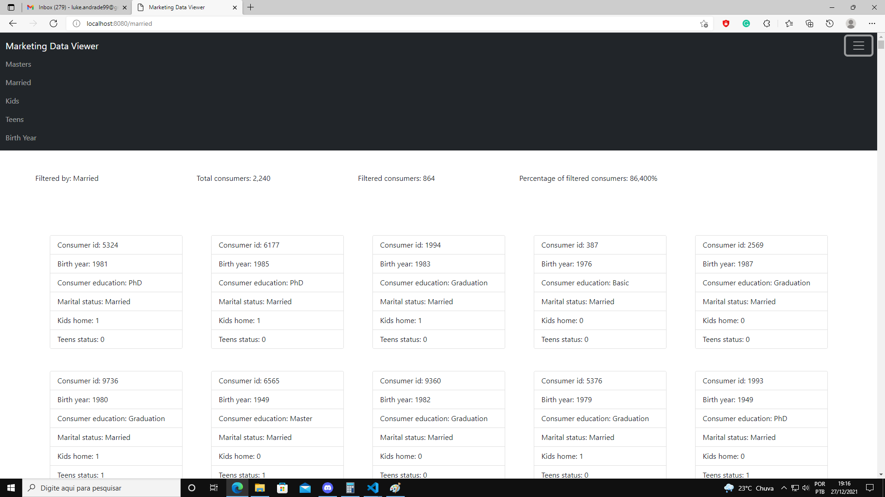

# What it does

The backend makes requests to the google sheets API according to the URL on the browser and builds a web page to display the data. Because the sheets Api don't filter the sheet by passing parameters within the requests I ended up filtering the response internally with java instead of using other [workarounds](https://stackoverflow.com/questions/67628828/use-google-spreadsheet-api-to-obtain-values-filtered-by-filter-view)

obs: It's responsive for smartphones too. 
It may be needed to change the spreadsheet URL in the SheetService.java and add google credentials to access the sheets API on the resources folder.

## Dependencies used

- Spring boot
- Lombok
- Freemarker
- Bootstrap
- Google sheets API for java

## Screenshots

# 🚀 Backend challenge

Welcome! This is the Google Sheets Backend Challenge!

Our main goal is to evaluate your coding and presentation skills.
When you feel ready to submit your answers, use the link we sent to your e-mail to post your Github Repo!
We will send you further instructions and your feedback then.

Any doubts, don't hesitate to contact us on *contato.steamgroups@gmail.com*
Happy Hacking💙!

> ⚠️ **Remember, your repository must be public, otherwise we won't be able to evaluate your answer**

---

## Table of Contents

- [🧠 Context](#-context)
- [⚔️ The Challenge](#️-the-challenge)
- [🏁 Requirements](#-requirements)
- [🤟 You Must](#-you-must)
- [🚰 Ideal Flux](#-ideal-flux)
- [✔️ Evaluation Criteria](#️-evaluation-criteria)
- [:notebook: To-do list](#notebook-to-do-list)
- [You can](#-you-can)

# 🧠 Context

Customer Personality Analysis is a detailed analysis of a company’s ideal customers. It helps a business to better understand its customers and makes it easier for them to modify products according to the specific needs, behaviors and concerns of different types of customers.

Customer personality analysis helps a business to modify its product based on its target customers from different types of customer segments. For example, instead of spending money to market a new product to every customer in the company’s database, a company can analyze which customer segment is most likely to buy the product and then market the product only on that particular segment.

This challenge aims to test your skills in analyzing and understanding spreadsheets and handling them from the [Googlesheet API](https://developers.google.com/sheets/api/guides/concepts); as well as data interpretation and the ability to visually display for a layman end user.

---
### ⚔️ The Challenge

The challenge is very simple, you must access the API and get some information (mentioned below) and then display it visually in the way you see fit. It can be creating a presentation, graphs, charts or whatever else you can imagine. Do it as creatively as you can.

To get the CSV File, access [here](https://drive.google.com/file/d/1JweH2MW-Vy8SgOHmevKW_k0JQpZjEG11/view?usp=sharing)

## 🏁 Requirements

- API Knowlegment
- Java Knowlegment

#### 🤟 You Must

- [x] Code in Java;
- [x] Find consumers born between 1957 and 1967 who have a master's degree and who are married;
- [x] What percentage of consumers found in relation to the total;
- [x] How many have children at home;
- [x] How many have teenagers at home;

### 🚰 Ideal Flux

- Find consumers born between 1957 and 1967 through the Googlesheet API;
- Create a filter to get only consumers who have a Master's degree;
- Create a filter to get only those consumers who are married;
  - Visually represent the data obtained;
- Calculate the percentage of consumers;
  - Visually represent the data obtained;
- Find the number of consumers who have children;
- Find the number of consumers who have teenagers;
  - Visually represent the data obtained;
---

**Essential Operations**

- [x] Carefully read the Googlesheet API documentation;
- [x] Save what you find necessary in variables;
- [x] :warning: Display the code output data;
 

## ✔️ Evaluation Criteria

In addition to the requirements raised above, we will look at the following criteria when correcting the challenge:

- If the challenge was fully accomplished;
- Whether the steps were successfully completed;
- If the code is clean and well documented;
- If the code is optimized;
- The form of presentation;
- Concern for the end user;

### :notebook: To-do list
- [x] Fully take the challenge
- [x] Find consumers born between 1957 and 1967;
- [x] Find the number of consumers who have children;
- [x] Find the number of consumers who have teenagers;
- [x] Include the details of your solution in the README;
- [x] What was accomplished in the challenge;
- [x] Instructions on how to check what was fulfilled;
- [x] Print the images that prove your solutions;
- [x] README must be in English;

### You can:
:information_source: _Feel free to include all the observations you may find necessary_

---

Made with 💜 by SteamGroups
